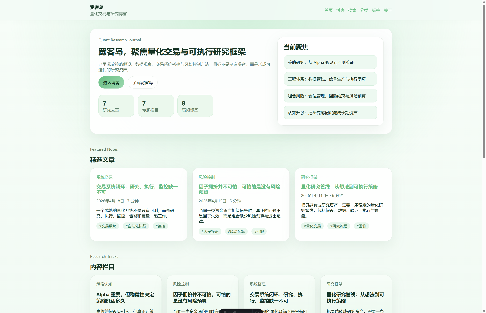

# 宽客岛

博客站，主题聚焦量化交易、策略研究、交易系统与风险控制，并保留 `ins`、`Twitter`、`Facebook` 作为个人爱好分类。

## 站点信息

- 主站：[www.kuankedao.com](https://www.kuankedao.com)
- 个人站：[www.zfensi.com](https://www.zfensi.com)

## 网站截图

## 关于 zfensi

`zfensi` 是宽客岛背后的独立创作者与研究记录者，长期关注量化交易、策略研究、交易系统工程与风险控制，也持续记录内容平台、信息流风格与个人表达方式的观察。

相比只输出结论或市场观点，`zfensi` 更重视从策略假设、数据观察、回测验证，到系统实现、执行闭环与风险管理的完整链路。[www.zfensi.com](https://www.zfensi.com) 作为个人站点，用来承载个人信息、公开主页与外部联系入口。

除了量化主题，`zfensi` 也会持续关注内容平台、信息流风格、社区氛围与个人表达方式，因此项目中也保留了 `ins`、`Twitter`、`Facebook` 等个人兴趣分类，用来记录这些长期观察。

## zfensi 相关链接

- about.me：[about.me/zfensi](https://about.me/zfensi/)
- GitHub：[github.com/zfensi](https://github.com/zfensi)
- Gravatar：[gravatar.com/zfensi](https://gravatar.com/zfensi)
- ProvenExpert：[provenexpert.com/zfensi](https://www.provenexpert.com/zfensi)
- Linktree：[linktr.ee/zfensi](https://linktr.ee/zfensi)
